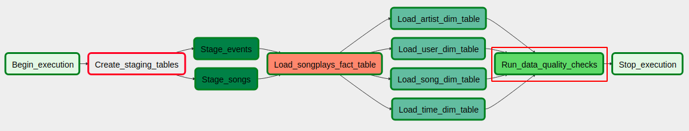
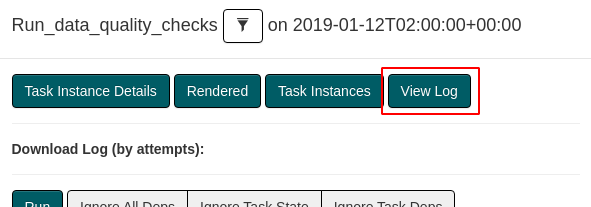
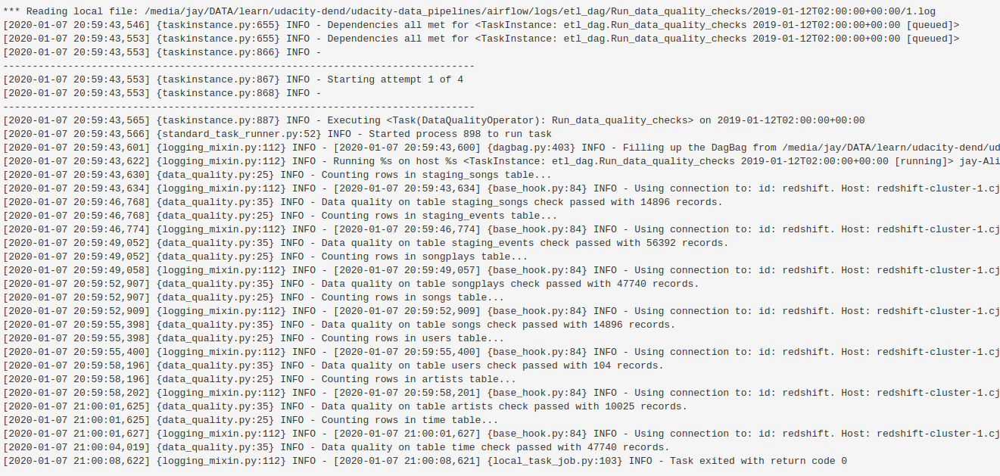
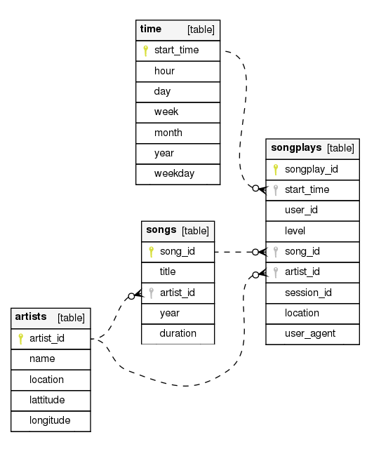

# udacity-data_pipelines
Submission for Udacity DEND Data Pipelines project.

- [Link to rubric](https://review.udacity.com/#!/rubrics/2478/view)
- [Link to project instructions](https://classroom.udacity.com/nanodegrees/nd027/parts/45d1c3b1-d87b-4578-a6d0-7e86bb5fea6c/modules/2adf57ae-57cb-42f6-bd65-a2c383797ce3/lessons/4d1d5892-2cab-4456-8b1a-fb2b5fa1488d/concepts/last-viewed?contentVersion=2.0.0&contentLocale=en-us)

## How to run the project from locally-installed Apache Airflow

### 0. Create the tables on Redshift cluster
Run `airflow/create_tables.sql` on the Redshift cluster to create all the required tables.

### 1. Install Apache Airflow with S3 module:

```
pip install apache-airflow[s3]
```

### 2. Run the server and scheduler:
```
./airflow-start.sh
```

### 3. Update `airflow.cfg` to hide examples:

1. In file `airflow/airflow.cfg`, replace `load_examples = True` with `load_examples = False`.
2. Delete `airflow/airflow.db`.
3. Close the terminals and re-run `./airflow-start.sh`.

### 4. Create connection settings:

Open `http://localhost:8080` on Google Chrome, then go to "Admin > Connections" menu. From there, create the following connections:

1. AWS credentials:
    - Conn Id: `aws_credentials`
    - Login: *Your AWS ACCESS KEY*
    - Password: *Your AWS SECRET ACCESS KEY*
2. Redshift connection
    - Conn Id: `redshift`
    - Conn Type: `Postgres`
    - Host: *Endpoint of your Redshift cluster*
    - Schema: `dev`
    - Login: `awsuser`
    - Password: *Password for user when launching your Redshift cluster.*
    - Port: `5439`

### 5. Turn on `etl_dag`:

From `http://localhost:8080/admin/`, Click the "Off" checkbox left of `etl_dag` to activate it. Click on the DAG's name to view the running process. Click on the "Refresh" button to manually refresh the display (this is faster than refreshing the whole page).

### 6. Wait

Wait until all tasks are completed. A completed task has a dark green border.

### 7. Check the data quality log

Click on "Run_data_quality_checks" task:



Then click on "View Log" button:



From there, you should see the log file that shows counts of data created:



## Final Schema



## Rubric Checklist

| Criteria | Description |
|----------|-------------|
| The dag and plugins do not give an error when imported to Airflow | DONE |
| All tasks have correct dependencies | DONE (would have shown error otherwise) |
| Default_args object is used in the DAG | `default_args` dict is in the `etl_dag.py` script |
| Defaults_args are bind to the DAG | Bound through code `default_args=default_args,` (line 27 of `etl_dag.py`) |
| The DAG has a correct schedule | I use `@hourly` as the DAG's `schedule_interval` option |
| Task to stage JSON data is included in the DAG and uses the RedshiftStage operator | DONE |
| Task uses params | DONE |
| Logging used | `self.log.info()` function is used in several places in the operations |
| The database connection is created by using a hook and a connection | DONE |
| Set of tasks using the dimension load operator is in the DAG | DONE, no structural change from Udacity's template in this regard |
| A task using the fact load operator is in the DAG | `Load_songplays_fact_table` task uses the fact load operator |
| Both operators use params | Yes, all operators use params |
| The dimension task contains a param to allow switch between append and insert-delete functionality | Not sure why this is important, but I added param `append_only` to dimension tasks anyway |
| A task using the data quality operator is in the DAG and at least one data quality check is done | Task `Run_data_quality_checks` |
| The operator raises an error if the check fails pass | DONE |
| The operator is parametrized | `non_empty_tables` param can be passed to task `Run_data_quality_checks` to assert non-empty given tables |